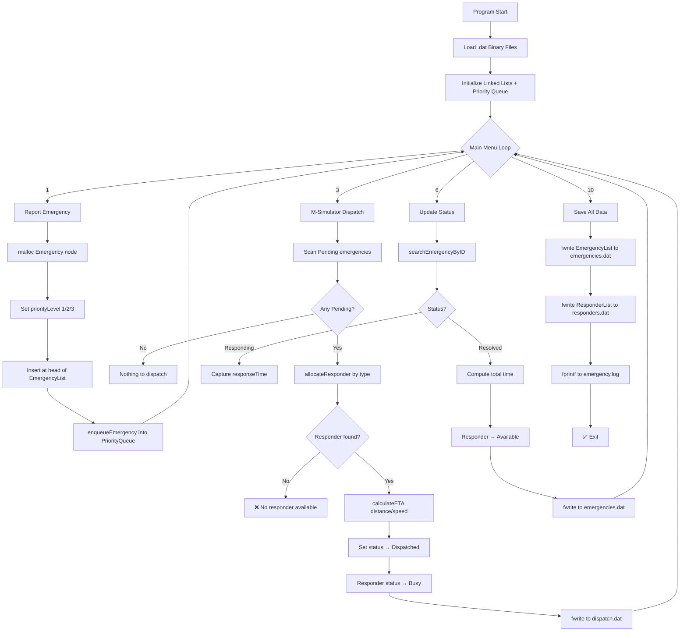

<div align="center">

# 🚨 Emergency Response System with M-Simulator

### *911 Dispatch Simulation & Incident Management in C*

[](https://en.wikipedia.org/wiki/C_(programming_language))
[](https://github.com)
[](./LICENSE)
[](https://github.com/snehalathaArakkonam/emergency-response-simulator-c)
[](https://github.com)
[](https://github.com)
[](https://github.com)
[](https://github.com)

> **A full-featured console-based 911 Emergency Dispatch Simulation** built in pure C — featuring priority queue dispatch, auto responder allocation (Police / Ambulance / Fire), incident lifecycle tracking, ETA calculation, M-Simulator engine, and persistent binary file storage.

[📌 Project Overview](#-project-overview) • [🧠 How It Works](#-how-it-works) • [📐 Architecture](#-system-architecture) • [🚀 Getting Started](#-getting-started) • [📊 Modules](#-modules) • [🎮 Sample I/O](#-sample-io--demo) • [📁 File Structure](#-file-structure)

</div>

---

## 📌 Project Overview

**Emergency Response System with M-Simulator** is a **console-based C application** that simulates a real-world 911 emergency dispatch center. When an incident is reported, the system automatically classifies it by priority (Critical → High → Normal), allocates the correct type of responder (Police / Ambulance / Fire), calculates an estimated time of arrival (ETA), and tracks the incident through its full lifecycle — from Pending → Dispatched → Responding → Resolved.

This project demonstrates mastery of:

| Concept | Implementation |
|---|---|
| **Priority Queues** | Three-tier dispatch queue: Critical (1) > High (2) > Normal (3) |
| **Linked Lists** | `Emergency*` and `Responder*` nodes with `next` pointers |
| **File Handling** | Binary `.dat` files for all persistent data |
| **Structures** | `Emergency`, `Responder`, `PriorityQueue`, `MSimulator` structs |
| **Distance Algorithm** | ETA = (distance / speed) × 60 minutes |
| **Sorting** | Priority-based emergency ordering for dispatch |
| **Simulation Engine** | M-Simulator auto-dispatches and resolves incidents |
| **Modular C** | 9 separate `.c` modules with clear responsibilities |

---

## 🧠 How It Works

### The Big Picture

```
User Launches Program
        │
        ▼
┌──────────────────────────────────────────┐
│            MAIN MENU (loop)              │
│  1. Report Emergency                     │
│  2. View All Emergencies                 │
│  3. M-Simulator Dispatch  ────────────►  │──► Priority Queue
│  4. Responder Management                 │──► Auto Allocate
│  5. Priority Queue Status                │──► ETA Calculate
│  6. Update Status                        │──► Binary File Write
│  7. ETA Calculator                       │
│  8. Emergency Statistics                 │
│  9. Admin Dashboard                      │
│  10. Exit + Save                         │
└──────────────────────────────────────────┘
        │
        ▼
  All data persists in .dat binary files
```

### Step-by-Step Lifecycle

**Step 1 — Report Emergency**
- User enters: incident type, priority, caller info, location, description
- System assigns a unique `emergencyID` (auto-increment)
- Priority level is set: `Critical=1`, `High=2`, `Normal=3`
- Status is set to `"Pending"`
- Emergency node is inserted at the head of `EmergencyList` (linked list)
- Emergency is also `enqueue`d into the correct priority queue tier

**Step 2 — Priority Queue**
- Three separate queues are maintained inside `PriorityQueue` struct:
  - `criticalQueue` → Heart attacks, building fires, armed crime
  - `highQueue` → Theft, road accidents, moderate fires
  - `normalQueue` → Traffic disputes, minor incidents
- `dequeueEmergency()` always processes Critical first, then High, then Normal

**Step 3 — M-Simulator Dispatch**
- Simulator scans all `"Pending"` emergencies in priority order
- For each emergency, `allocateResponder()` is called:
  - Medical/Accident → Ambulance
  - Crime/Traffic → Police
  - Fire → Fire Brigade
- Finds the first `"Available"` responder of matching type
- Updates responder status to `"Busy"`
- Calculates ETA: `rand()` distance (5–50 km) ÷ speed (50/60/70 km/h) × 60
- Updates emergency status to `"Dispatched"`
- Records `responseTime = time(NULL)`

**Step 4 — Status Lifecycle**
```
Pending  ──► Dispatched ──► Responding ──► Resolved
  (1)           (2)             (3)           (4)
```
- On `"Responding"`: `responseTime` timestamp is captured
- On `"Resolved"`: `resolvedTime` is captured, total time calculated
- Responder status flips back to `"Available"` once resolved

**Step 5 — ETA Calculator**
```
distance  = rand() % 46 + 5          // 5 to 50 km
speed     = 60 km/h (Ambulance)
          = 70 km/h (Police)
          = 50 km/h (Fire)
ETA (min) = (distance / speed) × 60
```

**Step 6 — Data Persistence**
- All structs saved as binary via `fwrite()` to `.dat` files
- Loaded on startup via `fread()`
- `emergency.log` gets timestamped text entries via `fprintf()`

---

## 📐 System Architecture

```
emergency-response-simulator-c/
│
├── emergency.c              ← MAIN FILE (entry point + menu loop)
├── emergency_module.c       ← Emergency CRUD + linked list
├── responder_module.c       ← Responder CRUD + allocation
├── dispatcher_module.c      ← M-Simulator dispatch engine
├── priority_module.c        ← Priority queue (enqueue/dequeue)
├── eta_module.c             ← ETA calculator (distance/speed)
├── status_module.c          ← Status update + resolution
├── statistics_module.c      ← Dashboard statistics
├── admin_module.c           ← Admin summary view
│
├── emergencies.dat          ← Binary: incident database
├── responders.dat           ← Binary: responder database
├── dispatch.dat             ← Binary: dispatch log
├── statistics.dat           ← Binary: aggregated stats
├── emergency.log            ← Text: timestamped activity log
│
├── Makefile                 ← Build automation
├── .gitignore
├── LICENSE
└── README.md
```

---

## 🔬 Data Structures Deep Dive

### Emergency Node (Linked List)
```c
typedef struct Emergency {
    int   emergencyID;
    char  incidentType[50];   // Medical | Crime | Fire | Traffic | Accident
    char  priority[20];       // Critical | High | Normal
    int   priorityLevel;      // 1=Critical, 2=High, 3=Normal
    char  callerName[50];
    char  callerPhone[15];
    char  location[200];
    double latitude;
    double longitude;
    char  description[500];
    char  status[20];         // Pending | Dispatched | Responding | Resolved
    int   responderID;
    char  responderType[20];  // Police | Ambulance | Fire
    long  dispatchTime;       // Unix timestamp
    long  responseTime;
    long  resolvedTime;
    int   responseMin;        // Actual response time in minutes
    int   etaseconds;         // Estimated arrival in seconds
    struct Emergency* next;   // Linked list pointer
} Emergency;
```

### Responder Node (Linked List)
```c
typedef struct Responder {
    int   responderID;
    char  responderType[20];  // Police | Ambulance | Fire
    char  name[50];
    char  phone[15];
    char  vehicleNumber[15];
    char  location[200];
    double latitude;
    double longitude;
    char  status[20];         // Available | Busy | OffDuty
    int   totalDispatches;
    int   totalResolutions;
    int   avgResponseTime;
    long  lastDispatchTime;
    struct Responder* next;   // Linked list pointer
} Responder;
```

### Priority Queue
```c
typedef struct PriorityQueue {
    Emergency* criticalQueue;  // Priority Level 1 — processed FIRST
    Emergency* highQueue;      // Priority Level 2 — processed SECOND
    Emergency* normalQueue;    // Priority Level 3 — processed LAST
    int criticalCount;
    int highCount;
    int normalCount;
} PriorityQueue;
```

### M-Simulator Tracker
```c
typedef struct MSimulator {
    char   simulatorName[50];
    char   version[10];
    int    totalSimulations;
    int    successfulSimulations;
    int    failedSimulations;
    double avgResponseTime;
} MSimulator;
```

### Priority Enqueue / Dequeue Logic
```c
// ENQUEUE — insert into correct tier
void enqueueEmergency(Emergency* e, PriorityQueue* q) {
    if(e->priorityLevel == 1) {
        e->next = q->criticalQueue;
        q->criticalQueue = e;
        q->criticalCount++;
    } else if(e->priorityLevel == 2) {
        e->next = q->highQueue;
        q->highQueue = e;
        q->highCount++;
    } else {
        e->next = q->normalQueue;
        q->normalQueue = e;
        q->normalCount++;
    }
}

// DEQUEUE — always Critical first
Emergency* dequeueEmergency(PriorityQueue* q) {
    if(q->criticalQueue != NULL) { ... return from criticalQueue; }
    if(q->highQueue     != NULL) { ... return from highQueue;     }
    if(q->normalQueue   != NULL) { ... return from normalQueue;   }
    return NULL;  // Queue empty
}
```

### Responder Auto-Allocation Logic
```c
// Incident Type → Responder Type Mapping
Medical   → Ambulance
Accident  → Ambulance
Crime     → Police
Traffic   → Police
Fire      → Fire

// Walks responder linked list, finds first AVAILABLE + MATCHING type
int allocateResponder(ResponderList* responders, char incidentType[]) {
    Responder* current = responders->head;
    while(current != NULL) {
        if(typeMatch && strcmp(current->status, "Available") == 0) {
            current->status = "Busy";
            current->totalDispatches++;
            return current->responderID;
        }
        current = current->next;
    }
    return 0;  // No responder found
}
```

---

## 📊 Modules

### Module 1 — Emergency Management (`emergency_module.c`)

| Function | Description |
|---|---|
| `addEmergency()` | Report new incident, assign ID + priority level |
| `displayAllEmergencies()` | Walk linked list, print all incidents |
| `searchEmergency()` | Search by ID or incident type |
| `updateEmergency()` | Edit emergency details |
| `resolveEmergency()` | Mark as Resolved, calculate total time |
| `emergencyByType()` | Filter: Medical / Crime / Fire etc. |
| `emergencyByPriority()` | Filter: Critical / High / Normal |
| `emergencyReport()` | Summary statistics |

### Module 2 — M-Simulator Dispatch Engine (`dispatcher_module.c`)

| Function | Description |
|---|---|
| `simulateDispatch()` | Scan all Pending → auto-allocate responder → set Dispatched |
| `simulateResolution()` | Scan all Dispatched → simulate 5–30 min resolution → Resolved |

### Module 3 — Responder Management (`responder_module.c`)

| Function | Description |
|---|---|
| `addResponder()` | Register Police / Ambulance / Fire unit |
| `displayAllResponders()` | List all with status indicators 🟢🔴🟡 |
| `searchResponder()` | Find by ID or type |
| `updateResponderStatus()` | Available / Busy / OffDuty toggle |
| `availableResponders()` | List only Available units |
| `responderByType()` | Filter by responder category |
| `allocateResponder()` | Auto-match and assign to emergency |

### Module 4 — Priority Queue (`priority_module.c`)

| Function | Description |
|---|---|
| `enqueueEmergency()` | Insert into Critical / High / Normal queue |
| `dequeueEmergency()` | Extract highest-priority emergency |
| `displayPriorityQueue()` | Show counts per tier |

### Module 5 — ETA Calculator (`eta_module.c`)

| Function | Description |
|---|---|
| `calculateETA()` | Compute arrival time from simulated distance + speed |
| `displayAllETAs()` | Show ETA for all Dispatched emergencies |

### Module 6 — Status Tracker (`status_module.c`)

| Function | Description |
|---|---|
| `updateEmergencyStatus()` | Move emergency through lifecycle |
| `searchEmergencyByID()` | Pointer lookup by emergency ID |

### Module 7 — Statistics (`statistics_module.c`)

| Function | Description |
|---|---|
| `emergencyStatistics()` | Count by status, avg response time, resolution rate |
| `responderStatistics()` | Availability %, total dispatches, resolutions |

### Module 8 — Admin Dashboard (`admin_module.c`)

| Function | Description |
|---|---|
| `adminDashboard()` | Full system overview: totals, rates, availability |

---

## 🗄️ File Handling

### Binary Files (`.dat`)

| File | Contents | Mode |
|---|---|---|
| `emergencies.dat` | All `Emergency` struct nodes | `rb+` / `wb+` |
| `responders.dat` | All `Responder` struct nodes | `rb+` / `wb+` |
| `dispatch.dat` | Dispatch event log (who went where, when) | `ab+` / `rb+` |
| `statistics.dat` | Aggregated counters and metrics | `rb+` / `wb+` |

### Text Log

| File | Contents |
|---|---|
| `emergency.log` | Timestamped text: reported, dispatched, resolved, errors |

### File Operations Used
```c
fopen()    // Open: rb+ read binary, wb+ write binary, ab+ append binary
fwrite()   // Write struct to binary file
fread()    // Read struct from binary file
fprintf()  // Write timestamped line to emergency.log
fclose()   // Always close — avoid data loss
// NULL check: if fopen() returns NULL → create file fresh
```

---

## 🚀 Getting Started

### Prerequisites
```bash
# Linux / macOS
gcc --version    # GCC 9+ recommended
make --version   # GNU Make

# Windows: use MinGW or WSL
```

### Installation & Build
```bash
# 1. Clone the repository
git clone https://github.com/snehalathaArakkonam/emergency-response-simulator-c.git
cd emergency-response-simulator-c

# 2. Build with Makefile
make

# 3. Run
./emergency
```

### Manual Compile (no Make)
```bash
gcc -o emergency emergency.c emergency_module.c responder_module.c \
    dispatcher_module.c priority_module.c eta_module.c \
    status_module.c statistics_module.c admin_module.c -lm

./emergency
```

---

## 🎮 Sample I/O — Demo

### ▶ Program Start

```
========================================
    EMERGENCY RESPONSE SYSTEM
    911 Dispatch & M-Simulator
========================================
1.  Report Emergency
2.  View All Emergencies
3.  M-Simulator Dispatch
4.  Responder Management
5.  Priority Queue
6.  Update Status
7.  ETA Calculator
8.  Emergency Statistics
9.  Admin Dashboard
10. Exit
========================================
Enter choice:
```

---

### ▶ Option 1 — Report Emergency

**Input:**
```
Enter choice: 1

=== REPORT EMERGENCY ===
Incident Type: Medical
Priority: Critical
Caller Name: Rahul Kumar
Phone: 9876543210
Location: MG Road, Bangalore
Description: Heart attack patient
```

**Output:**
```
✅ Emergency reported successfully!
 Emergency ID: 1
 Type: Medical
 Priority: Critical
 Status: Pending
🚨 Critical emergency added to queue!
```

**Input (second emergency):**
```
Incident Type: Crime
Priority: High
Caller Name: Priya Singh
Phone: 9876543211
Location: Park Street, Delhi
Description: Theft incident
```

**Output:**
```
✅ Emergency reported successfully!
 Emergency ID: 2
 Type: Crime
 Priority: High
 Status: Pending
⚠️ High priority emergency added to queue!
```

---

### ▶ Option 2 — View All Emergencies

**Input:** `2`

**Output:**
```
========================================
    ALL EMERGENCIES
========================================

1. Emergency ID: 1
   Type: Medical
   Priority: Critical
   Caller: Rahul Kumar (9876543210)
   Location: MG Road, Bangalore
   Status: Pending
========================================

2. Emergency ID: 2
   Type: Crime
   Priority: High
   Caller: Priya Singh (9876543211)
   Location: Park Street, Delhi
   Status: Pending
========================================
```

---

### ▶ Option 3 — M-Simulator Dispatch

**Input:** `3`

**Output:**
```
=== M-SIMULATOR: 911 DISPATCH SIMULATION ===
Simulating emergency dispatch process...

🚨 EMERGENCY DETECTED:
 ID: 1
 Type: Medical
 Priority: Critical
 Location: MG Road, Bangalore

🔍 Searching for available responder...
✅ Found: Ambulance (ID: 101, Location: Central Hospital)
✅ Responder Allocated: ID 101

📍 Distance: 15 km
   Speed: 60 km/h
   ETA: 15 minutes

✅ Ambulance is ON ROUTE!
Emergency ID: 1 → Status: Dispatched

--------------------------------------------

🚨 EMERGENCY DETECTED:
 ID: 2
 Type: Crime
 Priority: High
 Location: Park Street, Delhi

🔍 Searching for available responder...
✅ Found: Police (ID: 201, Location: South Station)
✅ Responder Allocated: ID 201

📍 Distance: 8 km
   Speed: 70 km/h
   ETA: 6 minutes

✅ Police is ON ROUTE!
Emergency ID: 2 → Status: Dispatched
```

---

### ▶ Option 4 — Responder Management

**Input:** `4`

**Output:**
```
========================================
    ALL RESPONDERS
========================================

1. Ambulance - ID: 101
   Name: Dr. Amit Sharma
   Phone: 9876543299
   Vehicle: AMB-001
   Location: Central Hospital
   Status: Busy
   Total Dispatches: 1
   Total Resolutions: 0
   🔴 BUSY
========================================

2. Police - ID: 201
   Name: Inspector Raj
   Phone: 9876543300
   Vehicle: PCR-001
   Location: South Station
   Status: Busy
   Total Dispatches: 1
   Total Resolutions: 0
   🔴 BUSY
========================================

3. Ambulance - ID: 102
   Name: Nurse Kavitha
   Vehicle: AMB-002
   Status: Available
   🟢 AVAILABLE
========================================
```

---

### ▶ Option 5 — Priority Queue Status

**Input:** `5`

**Output:**
```
========================================
    PRIORITY QUEUE STATUS
========================================

🚨 Critical Queue: 1 emergencies
⚠️ High Queue: 1 emergencies
ℹ️ Normal Queue: 0 emergencies

Total: 2 emergencies
========================================
```

---

### ▶ Option 6 — Update Status

**Input:**
```
Enter choice: 6
Enter Emergency ID: 1
Enter New Status: Responding
```

**Output:**
```
🔄 Updating Emergency: ID 1
Old Status: Dispatched
New Status: Responding
✅ Responder is now ON ROUTE!
```

**Update to Resolved:**
```
Enter Emergency ID: 1
Enter New Status: Resolved
```

**Output:**
```
🔄 Updating Emergency: ID 1
Old Status: Responding
New Status: Resolved
✅ Emergency RESOLVED!
   Total Time: 18 minutes
   Responder ID 101 → Status: Available
```

---

### ▶ Option 7 — ETA Calculator

**Input:** `7`

**Output:**
```
========================================
    ALL EMERGENCY ETAS
========================================

Emergency ID: 2
Type: Crime
Location: Park Street, Delhi
Responder: Police (ID: 201)

📍 Distance: 8 km
   Speed: 70 km/h
   ETA: 6 minutes
========================================
```

---

### ▶ Option 8 — Emergency Statistics

**Input:** `8`

**Output:**
```
========================================
    EMERGENCY STATISTICS DASHBOARD
========================================

Total Emergencies: 5
Pending:     1
Dispatched:  1
Responding:  1
Resolved:    2

Average Response Time: 16 minutes
Resolution Rate: 40.00%
========================================
```

---

### ▶ Option 9 — Admin Dashboard

**Input:** `9`

**Output:**
```
========================================
    ADMIN DASHBOARD
========================================

Total Emergencies:       5
Pending Emergencies:     1
Resolved Emergencies:    2
Active Incidents:        2

Total Responders:        10
Available Responders:    8
Busy Responders:         2
Availability Rate:       80.00%

Total Dispatches:        5
Total Resolutions:       2
Average Response Time:   16 minutes
Resolution Rate:         40.00%
========================================
```

---

### ▶ Option 10 — Exit

```
Emergency data saved successfully!
Thank you for using Emergency Response System!
```

---

## 🗺️ System Flow Diagram



---

## 🔢 Mathematical Formulas Used

```
ETA (minutes)    = (distance / speed) × 60
distance         = rand() % 46 + 5            // Simulated: 5 to 50 km
speed            = 60 km/h (Ambulance)
                 = 70 km/h (Police)
                 = 50 km/h (Fire Brigade)

resolution time  = resolvedTime - dispatchTime (in seconds → /60 for minutes)
resolution rate  = (resolvedCount / totalCount) × 100
avg response     = totalResponseMinutes / resolvedCount
availability %   = (availableResponders / totalResponders) × 100
```

---

## ⚠️ Input Validation Rules

| Input | Validation |
|---|---|
| Incident Type | Must be Medical / Crime / Fire / Traffic / Accident |
| Priority | Must be Critical / High / Normal → maps to level 1/2/3 |
| Caller Phone | Non-empty string check |
| Location | Non-empty string check |
| Emergency ID (update) | Must exist in linked list |
| Sell Quantity (responder) | Must be Available, matching type |
| File Open | If `fopen()` returns NULL → auto-create file fresh |
| Menu Choice | 1–10 only; invalid re-prompts |

---

## 🧩 Key Concepts Demonstrated

```
✅ Priority Queue        → Three-tier dispatch: Critical > High > Normal
✅ Linked Lists          → Emergency* and Responder* nodes with next pointers
✅ Dynamic Memory        → malloc() for every new Emergency / Responder node
✅ File Handling         → fwrite/fread binary; fprintf text log
✅ Structures            → Emergency, Responder, PriorityQueue, MSimulator
✅ Sorting Algorithm     → Priority-based dequeue order
✅ Distance Algorithm    → ETA = (distance / speed) × 60
✅ Status Lifecycle      → Pending → Dispatched → Responding → Resolved
✅ Auto Allocation       → Type-based responder matching engine
✅ Input Validation      → All inputs validated before processing
✅ Statistics Dashboard  → Resolution rate, avg response, availability %
✅ Modular C Design      → 9 separate .c files, clean separation of concerns
✅ M-Simulator Engine    → Batch dispatch + resolution simulation in one call
```

---

## 📁 File Structure

```
emergency-response-simulator-c/
│
├── 📄 emergency.c               ← Main file (750+ lines)
├── 📄 emergency_module.c        ← Emergency functions (180 lines)
├── 📄 responder_module.c        ← Responder functions (180 lines)
├── 📄 dispatcher_module.c       ← Dispatch simulation (160 lines)
├── 📄 priority_module.c         ← Priority queue (140 lines)
├── 📄 eta_module.c              ← ETA calculator (120 lines)
├── 📄 status_module.c           ← Status updates (120 lines)
├── 📄 statistics_module.c       ← Statistics (140 lines)
├── 📄 admin_module.c            ← Dashboard (120 lines)
│
├── 🗄️  emergencies.dat           ← Binary incident database
├── 🗄️  responders.dat            ← Binary responder database
├── 🗄️  dispatch.dat              ← Binary dispatch event log
├── 🗄️  statistics.dat            ← Binary aggregated stats
├── 📝 emergency.log             ← Text activity log
│
├── 🔧 Makefile                  ← Build automation
├── 📄 .gitignore
├── 📄 LICENSE
└── 📄 README.md
```

---

## 👩‍💻 Author

<div align="center">

**Snehalatha Arakkonam**
*B.Tech CSE — AI & ML Specialization*

[](https://github.com/snehalathaArakkonam)

</div>

---

<div align="center">

*🚨 Built with pure C — No APIs. No GUI. No real emergencies. Just clean systems programming.*

</div>
